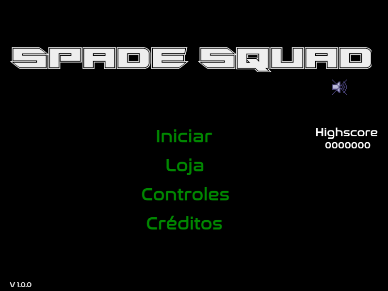
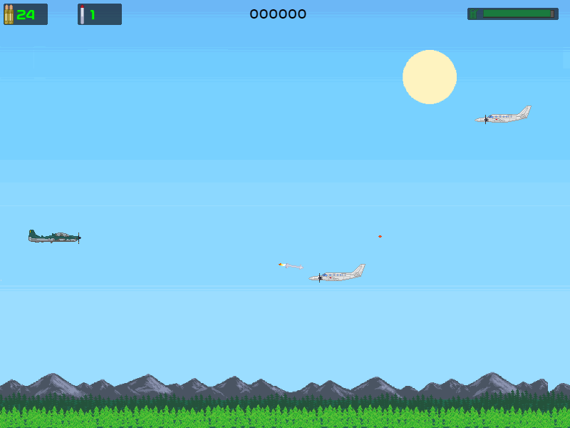

# Spade Squad


<div align='center'>

</div>

### :scroll: Sinopse

<p>Você é membro do esquadrão “spade”, que fiscaliza a fronteira do país. Pilote seu caça, derrube aviões de contrabando, antes que cruzem a fronteira. Confira se tem munição suficiente, e não esqueça de reabastecer seu combústivel. </p>

### :clapper: Sobre

<div align='center'>

  

</div>

* A barra verde no canto superior direito, indica o nível de combústivel. Se o nível estiver muito baixo um alerta irá tocar, pegue os galões pretos de combústivel para encher o nível novamente.
* No centro se encontra sua pontuação da partida. Sua pontuação será alterada a cada abate.
* No canto superior esquerdo, está sua quantidade de munição e mísseis. Pegue caixas de munição que acrescentaram uma certa quantia ao seu arsenal.
* Para consultar os controles, no menu principal click em **CONTROLES**.
* Compre upgrades para seu avião no menu principal, click em **LOJA**.

### :hammer_and_wrench: Tecnologias

[](https://skillicons.dev)

## :desktop_computer: Instalação

Para baixar às dependências, vai na raiz do projeto e use o comando:
```
npm i
```
ou
```
npm install
```
Para executar o projeto, após ter instalado as dependências use o comando:
```
npm start
```
Para fazer a build do projeto, utilize o comando:
```
npm run build
```
Logo após será criado a pasta `/dist` com os arquivos do game.

## :joystick: Teste online

<div align="center"><h2><a href="https://arcfives.github.io/Spade_squad/" >Testar Game</a></h2></div>
