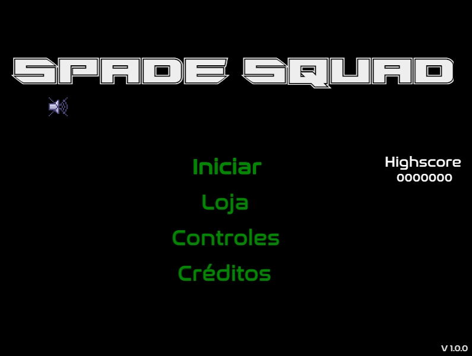

# :video_game: Spade Squad

---

### :scroll: Sinopse

> <p style="text-align: justify">Você é membro do esquadrão “spade”, que fiscaliza a fronteira do país. Pilote seu caça, derrube aviões de contrabando, antes que cruzem a fronteira. Confira se tem munição suficiente, e não esqueça de reabastecer seu combústivel. </p>

---

### :camera: Capturas de Tela




---

### :rocket: Como Jogar

<div align='center'>

</div>

- A barra verde no canto superior direito, indica o nível de combústivel. Se o nível estiver muito baixo um alerta irá tocar, pegue os galões pretos de combústivel para encher o nível novamente.
- No centro se encontra sua pontuação da partida. Sua pontuação será alterada a cada abate.
- No canto superior esquerdo, está sua quantidade de munição e mísseis. Pegue caixas de munição que acrescentaram uma certa quantia ao seu arsenal.
- Para consultar os controles, no menu principal click em **CONTROLES**.
- Compre upgrades para seu avião no menu principal, click em **LOJA**.

---

### :hammer_and_wrench: Tecnologias

[](https://skillicons.dev) [](https://phaser.io/)

---

## :gear: Instalação e Execução

#### Clone o repositório

```
git clone https://github.com/ARCFives/Spade_squad.git
```

#### Acesse o diretório

```
cd Spade_squad
```

#### Instale as dependências

```
npm install
```

#### Rode o jogo em ambiente de desenvolvimento

```
npm start
```

#### Build para produção

```
npm run build
```

---

## :package: Build

O projeto utiliza **Webpack** para gerenciamento de módulos e build. A estrutura inclui arquivos separados para desenvolvimento e produção:

- `webpack.common.js`
- `webpack.dev.js`
- `webpack.prod.js`

---

## :joystick: Jogue Online

<div align="center"><h2><a href="https://spadesquad.netlify.app/" >Jogar</a></h2></div>

---

## :bookmark_tabs: Licença

Este projeto está licenciado sob a [MIT License](LICENSE).

---

## :raising_hand: Autor

- **Gustavo Vieira** – [@ARCFives](https://github.com/ARCFives)
